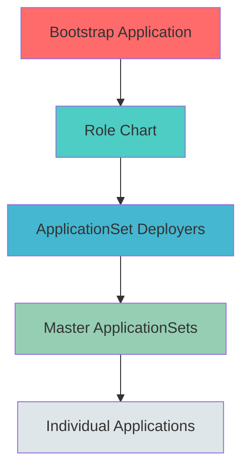

# OpenShift GitOps with Validated Patterns

[](https://www.redhat.com/en/technologies/cloud-computing/openshift)
[](https://validatedpatterns.io/)
[](https://argoproj.github.io/cd/)

**One Git repo to rule them all.** Deploy and manage OpenShift clusters with GitOps using the Red Hat Validated Patterns Framework.

**⚡ Quick Start:** [GETTING-STARTED.md](GETTING-STARTED.md) - Get running in 35 minutes

---

## What's Inside?

This repository provides everything needed to manage OpenShift clusters via GitOps:

- 🎯 **23 Platform Components** - Storage (TrueNAS/Synology/MinIO), Secrets (ESO), Certificates, GPU Operators, Monitoring (Gatus/VPA), Backup (Kasten), Multi-cluster (ACM/MCE)
- 📦 **38+ Applications** - Media stack (Plex, \*arr apps), AI (Ollama, LiteLLM), Home Automation (Home Assistant), Productivity tools
- 🏗️ **3-Level Architecture** - Bootstrap → Roles → ApplicationSets → Applications (Validated Patterns Framework)
- ⚙️ **Hierarchical Config** - Global → Cluster Set → Cluster values inheritance
- 🔄 **Multi-Cluster Ready** - Manage home lab, work lab, and cloud from one repo

## How It Works



**3-Level GitOps Architecture:**

1. **Bootstrap** (manual) - One Application named "cluster" points to `roles/<cluster>/`
2. **Roles** - Helm chart deploys ApplicationSet deployers for platform/domains
3. **ApplicationSets** - Generate child Applications from enabled lists in values files
4. **Applications** - Individual Helm charts (Plex, Ollama, etc.)

**Configuration Hierarchy:**

```
values-global.yaml (pattern defaults)
  ↓
clusters/sets/values-home.yaml (cluster set: home lab)
└──
clusters/individual-clusters/values-prod.yaml (specific cluster)
```

## Quick Start

```bash
# 1. Install OpenShift GitOps
oc apply -f https://raw.githubusercontent.com/YOUR_USERNAME/argo-apps/main/bootstrap/operator.yaml

# 2. Grant permissions
oc apply -f https://raw.githubusercontent.com/YOUR_USERNAME/argo-apps/main/bootstrap/rbac.yaml

# 3. Bootstrap your cluster
oc apply -f bootstrap/cluster-application.yaml

# 4. Watch deployment
oc get applications -A -w
```

**Full guide:** [GETTING-STARTED.md](GETTING-STARTED.md)

## Repository Structure

```
├── values-global.yaml         # Pattern defaults (all clusters)
├── clusters/                   # Values file organization
│   ├── individual-clusters/   # Per-cluster values (hub, prod, test)
│   ├── sets/                  # Cluster set values (home, worklab, cloud)
│   └── topologies/            # Topology defaults (compact, full)
│
├── roles/                      # Topology role definitions
│   ├── sno/                    # Single Node OpenShift topology
│   ├── compact/                # Compact cluster topology (3 nodes)
│   └── full/                   # Full HA topology (6+ nodes)
│
├── charts/
│   ├── platform/               # 22 infrastructure components
│   └── applications/           # 38+ user applications
│       ├── ai/                 # Ollama, LiteLLM, Open-WebUI
│       ├── media/              # Plex, Sonarr, Radarr, etc. (21 apps)
│       ├── home-automation/    # Home Assistant, Node-RED, EMQX
│       ├── productivity/       # Bookmarks, CyberChef, Excalidraw
│       └── infrastructure/     # Paperless, ADSB, Glue-Worker
│
├── docs/                       # Complete documentation
│   ├── operations/             # Operational guides (bootstrap, ACM, kubeconfig)
│   ├── deployment/             # Deployment pattern guides
│   ├── decisions/              # Architectural Decision Records
│   └── instructions/           # Step-by-step workflows
└── scripts/                    # Utility scripts and ACM manifests
```

## Available Content

### Platform Components (23)

**Security & Secrets:** External Secrets Operator, Certificates
**Storage:** TrueNAS CSI, Synology CSI, AIStor MinIO Operator, MetalLB
**Node & Resource:** OpenShift NFD, VPA, Goldilocks, GPU Operators
**Monitoring:** Gatus, Custom Error Pages
**Backup & HA:** Kasten K10, Keepalived
**Multi-Cluster:** ACM, Multicluster Engine

### User Applications (38+)

**AI/ML (3):** Ollama, LiteLLM, Open-WebUI
**Media (21):** Plex, Sonarr, Radarr, Overseerr, Prowlarr, Bazarr, Tautulli, Lidarr, Readarr, Kapowarr, Kavita, SABnzbd, and more
**Home Automation (4):** Home Assistant, Node-RED, EMQX Operator, Zwavejs2MQTT
**Productivity (6):** Bookmarks, CyberChef, Excalidraw, IT-Tools, Startpunkt, Terraform Enterprise
**Infrastructure (4):** Paperless suite, ADSB tracking, Glue-Worker

<details>
<summary>📋 Click for complete application list</summary>

**AI/ML:** Ollama, LiteLLM, Open-WebUI

**Media:** Plex, Sonarr, Radarr, Overseerr, Prowlarr, Bazarr, Tautulli, Lidarr, Readarr, Kapowarr, Kavita, SABnzbd, FlareSolverr, Metube, Pinchflat, Gaps, Huntarr, Posterizarr, Recyclarr, Jellyfin, Jellyseerr

**Home Automation:** Home Assistant, Node-RED, EMQX Operator, Zwavejs2MQTT

**Productivity:** Bookmarks, CyberChef, Excalidraw, IT-Tools, Startpunkt, Terraform Enterprise

**Infrastructure:** Paperless-NGX, Paperless-GPT, Paperless-Worker, ADSB, Glue-Worker

</details>

## Documentation

### 🚀 Getting Started

- **[Quick Start Guide](GETTING-STARTED.md)** - 30-minute deployment walkthrough
- **[Cluster Bootstrap](docs/operations/CLUSTER-BOOTSTRAP.md)** - Complete step-by-step setup
- **[Deployment Options](docs/deployment/DEPLOYMENT-OPTIONS.md)** - Choose your deployment pattern

### 📚 Development

- **[Chart Standards](docs/CHART-STANDARDS.md)** - Creating compliant Helm charts
- **[Change Management](docs/CHANGE-MANAGEMENT.md)** - Making safe changes
- **[Adding Applications](docs/instructions/adding-an-application-checklist.md)** - Complete checklist

### 📖 Reference

- **[Values Hierarchy](docs/VALUES-HIERARCHY.md)** - Configuration inheritance
- **[Architectural Decision Records](docs/decisions/)** - Why things work this way
- **[Repository Organization](docs/REPOSITORY-ORGANIZATION-PROPOSAL.md)** - Multi-site strategy
- **[Chart Exceptions](docs/CHART-EXCEPTIONS.md)** - Documented deviations

### 🔧 Troubleshooting

- **[OpenShift Connectivity](docs/troubleshooting/openshift-connectivity.md)**
- **[TrueNAS CSI Issues](docs/troubleshooting/truenas-csi.md)**
- **[NFS Storage](docs/troubleshooting/nfs-storage.md)**
- **[Keepalived](docs/troubleshooting/keepalived.md)**

## Common Tasks

### Enable an Application

Edit `values-mycluster.yaml`:

```yaml
applicationStacks:
  ai:
    enabled: true
    apps:
      - ollama # Uncomment to enable
      - open-webui
```

Commit → Push → Argo CD syncs automatically.

### Add New Application

```bash
# 1. Create chart
mkdir -p charts/applications/<domain>/<app>

# 2. Add to values files
python3 scripts/generate-app-list-template.py

# 3. Verify
scripts/verify-app-inventory.sh

# 4. Validate
python3 scripts/audit/audit-chart-standards.py --chart charts/applications/<domain>/<app>
```

**Full guide:** [Adding Applications Checklist](.github/instructions/adding-an-application-checklist.md)

### Change Configuration

Edit values file, commit, and push:

```yaml
applications:
  plex:
    storage:
      media:
        size: 2Ti # Override default
```

### Troubleshoot Failed Sync

```bash
# Check Application status
oc describe application plex -n openshift-gitops

# View pod logs
oc logs -n plex -l app=plex

# Force manual sync
oc patch application plex -n openshift-gitops \
  --type merge -p '{"operation":{"initiatedBy":{"username":"admin"},"sync":{}}}'
```

## Key Features

### OpenShift Integration

- ✅ **Routes** - Automatic HTTPS routes with edge termination
- ✅ **Console Links** - Apps appear in OpenShift web console
- ✅ **Security** - Works with restricted SCC (no privileged containers)
- ✅ **Storage** - Flexible CSI driver support (TrueNAS, Synology, ODF)

### GitOps Best Practices

- ✅ **Declarative** - Everything defined in Git
- ✅ **Automated** - Argo CD syncs changes automatically
- ✅ **Auditable** - Git history tracks all changes
- ✅ **Revertible** - Roll back via Git revert

### Multi-Cluster Support

- ✅ **Cluster Sets** - Group clusters (home lab, work lab, cloud)
- ✅ **Topology Aware** - SNO, Compact (3-node), Full (6+ nodes)
- ✅ **Hub Management** - ACM/MCE for fleet management
- ✅ **Values Hierarchy** - Share config, override per cluster

## Support & Contributing

- **Issues:** [GitHub Issues](https://github.com/rbales79/argo-apps/issues)
- **Discussions:** [GitHub Discussions](https://github.com/rbales79/argo-apps/discussions)
- **Based on:** [ullbergm/openshift](https://github.com/ullbergm/openshift)

## License

This project is provided as-is for educational and homelab use.

---

**Ready to get started?** → [GETTING-STARTED.md](GETTING-STARTED.md)
**Need help?** → [Documentation Index](docs/README.md)
**Want details?** → [Complete Overview](docs/DETAILED-OVERVIEW.md)
